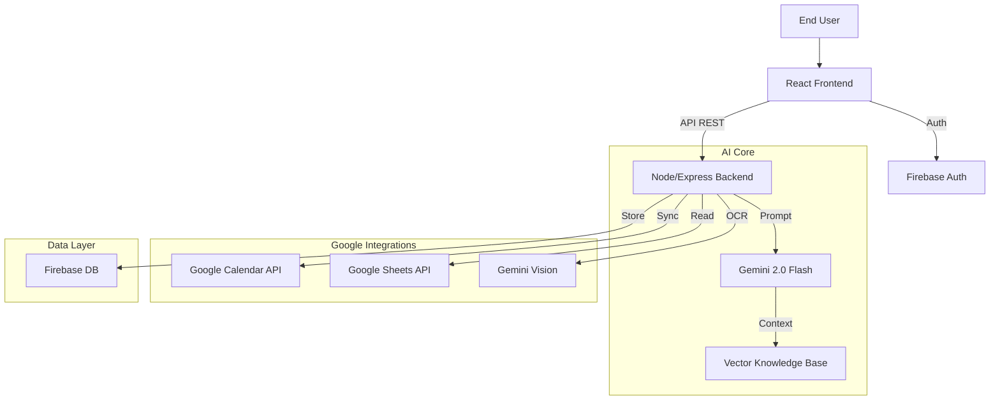

# 🦅 TaxAlly - AI-Powered Tax & Compliance Agent for MSMEs

> **Team Hawks (GFG ByteQuest 2025)**  
> *Empowering 6.3 Crore Indian MSMEs with Autonomous Financial Intelligence.*

TaxAlly is a comprehensive, AI-driven financial assistant designed to simplify tax compliance, filing, and financial planning for freelancers and micro-businesses in India. It combines the power of **Google Gemini 2.0 Flash**, **Firebase**, and **Google Workspace APIs** to create a seamless, automated compliance experience.


---

## 🚀 Key Features

### 1. 🤖 AI Tax Copilot
A context-aware chat agent powered by **Gemini 2.0 Flash**.
*   **Contextual Knowledge**: Remembers your profile (Turnover, GSTIN, Business Type).
*   **Legal Expertise**: Trained on Indian Tax Laws (GST, 44AD/ADA, TDS).
*   **Actionable Tools**: Can calculate taxes, check GST thresholds, and analyze compliance instantly.
*   **Voice-Enabled**: Speak to your CA naturally.


### 2. 📅 Smart Calendar Sync
Never miss a deadline again.
*   **Two-Way Integration**: Connects directly to your **Google Calendar**.
*   **Auto-Sync**: Pushes critical tax deadlines (GSTR-3B, Advance Tax) to your schedule.
*   **Smart Reminders**: Sets email (24h) and popup (1h) alerts automatically.


### 3. 📄 Document Intelligence (OCR)
Upload tax notices, invoices, or bank statements.
*   **Gemini Vision Analysis**: Extracts key data from PDFs/Images.
*   **Bank Statement Parser**: Categorizes transactions into Credit/Debit automatically.
*   **Notice Decoder**: Explains complex government notices in simple English.

### 4. 📊 Unified Financial Dashboard
real-time view of your compliance health.
*   **Compliance Score**: Dynamic 0-100 rating of your tax health.
*   **Turnover Tracking**: Visual graphs of your income vs. tax limits.
*   **Pending Actions**: Prioritized list of obligations.

---

## 🏗️ Technical Architecture

TaxAlly is built on a modern, scalable full-stack architecture.

### Tech Stack
*   **Frontend**: React 19, TypeScript, TailwindCSS v4, Framer Motion, Lucide Icons.
*   **Backend**: Node.js, Express, TypeScript.
*   **AI Engine**: Google Gemini 2.0 Flash (via `@google/generative-ai`).
*   **Database & Auth**: Firebase (Firestore, Auth, Admin SDK).
*   **Integrations**: Google Calendar API (`googleapis`), Nodemailer.

### System Design


### Key Innovations
1.  **Hybrid Tool Use**: The AI doesn't just chat; it executes server-side tools (e.g., `calculate_tax`, `check_gst`) and client-side actions (e.g., `calendar_create_event`) seamlessly.
2.  **Context Pruning**: Dynamically injects only relevant tax laws into the context window to optimize latency and accuracy.
3.  **Secure Proxy**: All sensitive API calls (Calendar, Gemini) are routed through the backend to protect API keys.

---

## 🛠️ Getting Started

### Prerequisites
*   Node.js v20+
*   Google Cloud Project (with Calendar & Gemini APIs enabled).
*   Firebase Project.

### Installation

1.  **Clone the Repository**
    ```bash
    git clone https://github.com/ByteQuest-2025/GFGBQ-Team-Hawks-2.git
    cd GFGBQ-Team-Hawks-2
    ```

2.  **Frontend Setup**
    ```bash
    npm install
    npm run dev
    ```

3.  **Backend Setup**
    ```bash
    cd server
    npm install
    npm run dev
    ```

### Environment Variables (.env)
Create a `.env` in `server/`:
```env
PORT=3001
TAXALLY_API_KEY=your_gemini_key
GOOGLE_PRIVATE_KEY="your_private_key"
FIREBASE_SERVICE_ACCOUNT={...}
```

---

## 👥 Contributors

*   **Aditya Sabnis** - Full Stack & AI Lead

---

*Built with ❤️ for GFG ByteQuest 2025.*
